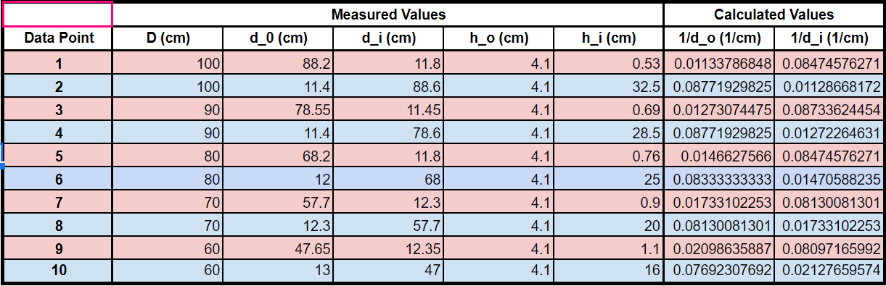
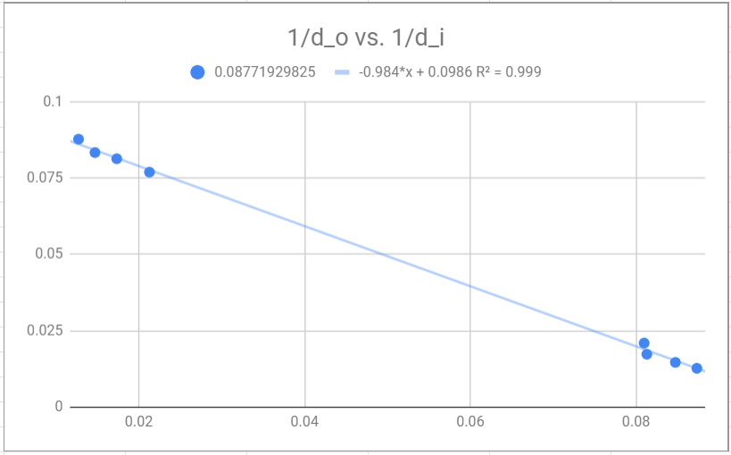

Gabriel Paris  
Xander Waltman  
Miles Strubel  
PH 216  
TA: James Powell

# Lab 4: Lenses

### Introduction & Preparation

### Procedure

### Data
|Focal length| Measurement (cm)|
|---|---|
|Convex Lens| 12.1 cm|
|Concave Lens| 6.65 cm|
|Convex Lens 30 cm behind Concave Lens| 17.4 cm|
|+100 mm Lens| 9.00 cm|

Table 1: Observed values of distance from image and the height of the image.  
  

Plot 1: Relationship between inverse initial distance and inverse final distance.  
  
### Analysis

### Conclusion

### Questions
1. *Write down the equation for Snell's Law and draw a descriptive diagram showing the variables.*
1. *What do you think might be the difference between a positive and negative lens?*
1. *Draw what you think a concave lens would look like.*
1. *Draw what you think a convex lens would look like.*
1. *Is the focal point of the lens in front (between the light source and the lens) or behind (other side of the lens with respect to the light source) the lens? Explain.*
1. *Is the focal point of the lens in front or behind the lens? Explain.*
1. *What does this tell you about the differences between the focal points and focal lengths of convex and concave lenses?*
1. *What can you saw about the relationship between the two lenses in terms of their focal lengths?*
1. *What happens to the focal point of the lens system as you move the concave lens further away from the convex lens?*
1. *For what positions of the concave lens do you get a real focal point?*
1. *Where is the focal point for this lens system?*
1. *Is the focal point real or virtual?*
1. *Does reversing the order of the lenses matter? Why or why not?*
1. *Do the outer two rays have a different focal length than the two inner rays? How much do they differ? Which focal point do you think is closer to the actual (specified) focal point of the lens? Why?*
1. *Compare the quality of the focus of this system to that of the single convex lens system. Do all five rays cross in the same place when using both convex lenses? Explain?*
1. *Write down the thin lens equation and define each variable. You may use your text if necessary.*
1. *How can you get the focal length from the image distance you just measured? Hint: make the approximation that the light source is at infinity, solve for the focal length of the lens using the thin lens formula.*
1. *Is the image formed upright or inverted? What does this tell you about the lens?*
1. *Is the image real or virtual? How do you know?*
1. *Why are there two positions where the image is in focus?*
1. *Write down the equation for magnification by a thin lens.*
1. *What is the significance of the negative sign?*
