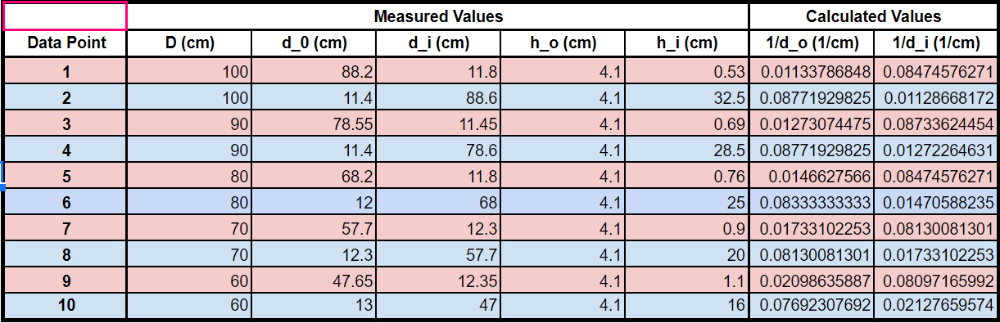
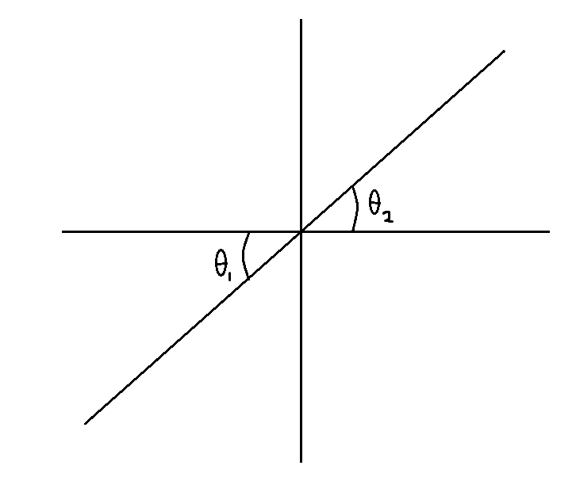
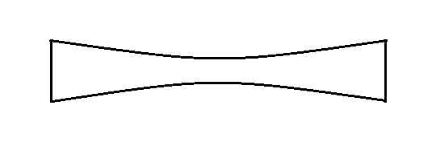
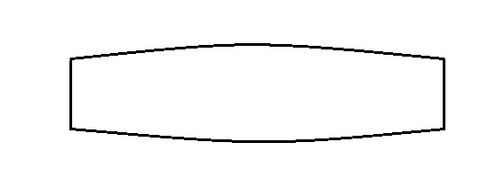

Gabriel Paris  
Xander Waltman  
Miles Strubel  

PH 216  
TA: James Powell  

# Makeup Lab: Lenses

### Introduction & Preparation
The purpose of the lab was to become familiar with and properly utilize equations and terms to understand how light behaves when it passes through lenses. This was done by shining light rays through different lenses and recording the focal points. We were able to show that light obeys laws such as Snell's Law, as well as equations such as the Thin Lens Equation[1], Thin Lens Equation[2] and Magnification Equation[3].

Snell's Law says that the angle of refraction before and after light passes through a medium of given index are equivalent. That is,

n1sin&theta;1 = n2sin&theta;2 [1]

  
There is also a relationship between the distance of the image, the object (that is, the image that is produced and the image source), and the focal length.

1/f = 1/do + 1/di
[2]

This is known as the Thin Lens Equation.  
The final equation that is relevant for this lab is the Magnification Equation, which shows the relationship between the height of the image with respect to the object and the distance between the image and the object.

M = hi/ho = -di/do
[3]

  

### Procedure  
The first part of the procedure focused on the refraction of convex and concave lenses. The focal point of the lens was measured by shining five light rays from a light box onto paper and tracing the light rays when a convex and concave lens were placed in the light path. The focal length was determined by measuring from the lens to the point at which the rays converge. The light box was changed to the three-light-ray setting, and the two lenses were then put in front of the light source together to observe and record the difference in focal point. The distance of the concave lens from the convex lens was changed to record how the distance affected the focal point of the light source. To see how the angle of refraction affected the focal point of the light, the five-light-ray setting was used, except the middle three rays and the outer two rays were blocked out in turn, so the remaining light rays refracted in the lens and the focal point could be measured.

For the second part of the procedure, a light box, a screen, and a optical bench were used to determine the focal length of a thin lens. The positive lens used could be secured to the optical bench, and the screen was set up at the end opposite the light source, that is, opposite ends of the optical bench. With the light source stationary, the lens was moved down the optical bench until two different images become focused (indicating that there is a focal point). The distance from the light source to the lens, the distance from the lens to the screen, the height of the object (which is constant), and the height of the image were recorded in Table 1. The screen was then moved closer to the light source, which was recorded as well, until two images could no longer be identified.  

### Data  
|Focal length with:| Measurement (cm)|
|---|---|
|Convex Lens| 12.1 cm|
|Concave Lens| 6.65 cm|
|Convex Lens 30 cm behind Concave Lens| 17.4 cm|
|+100 mm Lens| 9.00 cm|

Table 1: Observed values of distance from image and the height of the image.  
  

Plot 1: Relationship between inverse initial distance and inverse final distance.  
  

### Analysis  
An interesting observation was that the plot in Plot 1 had two "clusters" of data points, which correspond to the two focal points that were identified in the thin lens part of the procedure. Another observation is that, in the focal length part of the procedure, the focal point of the convex lens is about two times further from the lens as the focal point by the concave lens.  

### Conclusion  
This lab showed how light travels through a lens, and how the shape of the lens (concave versus convex) changes the focal point of the light rays. For the thin lens part of the procedure, we could see the application of the Magnification equation, which resulted in a small magnification when the lens was near the light source, and a large magnification when the lens was further from the light source.  

### Questions  
1. *Write down the equation for Snell's Law and draw a descriptive diagram showing the variables.*  
n1sin&theta;1 = n2sin&theta;2

1. *What do you think might be the difference between a positive and negative lens?*  
A positive lens has its focal point in front of it and a negative lens has its focal point behind it.  
1. *Draw what you think a concave lens would look like.*  

1. *Draw what you think a convex lens would look like.*  

1. *Is the focal point of the lens in front (between the light source and the lens) or behind (other side of the lens with respect to the light source) the lens? Explain.*  
The focal point is behind the lens. It is similar to light approaching the edge of a circle from the outside.
1. *Is the focal point of the lens in front or behind the lens? Explain.*  
The focal point is in front of the lens. It is similar to light approaching the edge of a circle from the inside.
1. *What does this tell you about the differences between the focal points and focal lengths of convex and concave lenses?*  
This shows that there are different focal points for the lenses, which is what we determined earlier in the procedure.
1. *What can you saw about the relationship between the two lenses in terms of their focal lengths?*  
The curve of the convex and concave lens are approximately the same, so they cancel each other out when used simultaneously.
1. *What happens to the focal point of the lens system as you move the concave lens further away from the convex lens?*  
The focal point gets closer to the convex lens as the lens is moved further away from the concave lens and the light source.
1. *For what positions of the concave lens do you get a real focal point?*  
We first saw a focal point at 14 centimeters from the light source, and we got a clearer focal pint as we moved the lens further from the light source until the outer light beams were no longer passing through the lens.
1. *Where is the focal point for this lens system?*  
The focal point is 49 centimeters away from the light source.
1. *Is the focal point real or virtual?*  
The focal point is real.
1. *Does reversing the order of the lenses matter? Why or why not?*  
The order of the lenses matters because the convex lens refracts the light inwards, which creates a focal point between the two lenses.
1. *Do the outer two rays have a different focal length than the two inner rays? How much do they differ? Which focal point do you think is closer to the actual (specified) focal point of the lens? Why?*  
The outer two rays have a shorter focal length (13.4 centimeters) than the inner three rays (15.5 centimeters), differing by 2.1 centimeters. The outer two rays are closer to the actual focal point than the inner three because there is more refraction, that is, the angle &theta; is bigger.
1. *Compare the quality of the focus of this system to that of the single convex lens system. Do all five rays cross in the same place when using both convex lenses? Explain?*  
The second lens shortens the focal length because the light rays are already angled from the first lens.
1. *Write down the thin lens equation and define each variable. You may use your text if necessary.*  
1/f = 1/do + 1/di &rarr; 0 = d02 - Ddi + Df  
do = object distance  
di = image distance  
f = focal length  
1. *How can you get the focal length from the image distance you just measured? Hint: make the approximation that the light source is at infinity, solve for the focal length of the lens using the thin lens formula.*  
If the light source is approximated to be at infinity, the equation reduces to Df + Ddi. The value comes out to 10 centimeters.
1. *Is the image formed upright or inverted? What does this tell you about the lens?*  
The image is inverted. There is a focal point between the lens and the screen, so the light inverts.
1. *Is the image real or virtual? How do you know?*  
The image is virtual because the image is inverted.
1. *Why are there two positions where the image is in focus?*  
The two positions indicate the focal points of specific rays of light. For the light that passes through the lens at a larger angle, the focal point will be closer to the lens, and when the light passes through the lens at a smaller angle, the focal point will be farther away. This was shown earlier in the procedure when the beams of light didn't completely converge to the focal point.
1. *Write down the equation for magnification by a thin lens.*  
M = hi/ho = -di/do
1. *What is the significance of the negative sign?*  
The negative sign indicates that the image is inversed.
