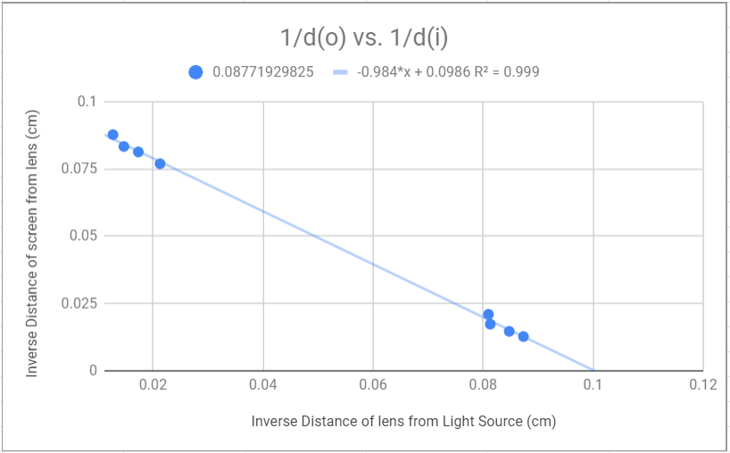

Gabriel Paris  
Xander Waltman  
Miles Strubel  
PH 216  
TA: James Powell

# Lab 4: Lenses

### Introduction & Preparation

### Procedure

### Data
|Focal length with| Measurement (cm)|
|---|---|
|Convex Lens| 12.1 cm|
|Concave Lens| 6.65 cm|
|Convex Lens 30 cm behind Concave Lens| 17.4 cm|
|+100 mm Lens| 9.00 cm|

Table 1: Observed values of distance from image and the height of the image.  
  

Plot 1: Relationship between inverse initial distance and inverse final distance.  
  
### Analysis

### Conclusion

### Questions
1. *Write down the equation for Snell's Law and draw a descriptive diagram showing the variables.*  
n1sin&theta;1 = n2sin&theta;2  
1. *What do you think might be the difference between a positive and negative lens?*  
A positive lens has its focal point in front of it and a negative lens has its focal point behind it.  
1. *Draw what you think a concave lens would look like.*  

1. *Draw what you think a convex lens would look like.*  

1. *Is the focal point of the lens in front (between the light source and the lens) or behind (other side of the lens with respect to the light source) the lens? Explain.*  
The focal point is behind the lens. It is similar to light approaching the edge of a circle from the outside.
1. *Is the focal point of the lens in front or behind the lens? Explain.*  
The focal point is in front of the lens. It is similar to light approaching the edge of a circle from the inside.
1. *What does this tell you about the differences between the focal points and focal lengths of convex and concave lenses?*  

1. *What can you saw about the relationship between the two lenses in terms of their focal lengths?*  
The curve of the convex and concave lens are approximately the same, so they cancel each other out when used simultaneously.
1. *What happens to the focal point of the lens system as you move the concave lens further away from the convex lens?*  
The focal point gets closer to the convex lens as the lens is moved further away from the concave lens and the light source.
1. *For what positions of the concave lens do you get a real focal point?*  
We first saw a focal point at 14 centimeters from the light source, and we got a clearer focal pint as we moved the lens further from the light source until the outer light beams were no longer passing through the lens.
1. *Where is the focal point for this lens system?*  
The focal point is 49 centimeters away from the light source.
1. *Is the focal point real or virtual?*  
The focal point is real.
1. *Does reversing the order of the lenses matter? Why or why not?*  
The order of the lenses matters because the convex lens refracts the light inwards, which creates a focal point between the two lenses.
1. *Do the outer two rays have a different focal length than the two inner rays? How much do they differ? Which focal point do you think is closer to the actual (specified) focal point of the lens? Why?*  
The outer two rays have a shorter focal length (13.4 centimeters) than the inner three rays (15.5 centimeters), differing by 2.1 centimeters. The outer two rays are closer to the actual focal point than the inner three because there is more refraction, that is, the angle &theta; is bigger.
1. *Compare the quality of the focus of this system to that of the single convex lens system. Do all five rays cross in the same place when using both convex lenses? Explain?*  
The second lens shortens the focal length because the light rays are already angled from the first lens.
1. *Write down the thin lens equation and define each variable. You may use your text if necessary.*  
1/f = 1/do + 1/di &rarr; 0 = d02 - Ddi + Df  
do = object distance  
di = image distance  
f = focal length  
1. *How can you get the focal length from the image distance you just measured? Hint: make the approximation that the light source is at infinity, solve for the focal length of the lens using the thin lens formula.*  
If the light source is approximated to be at infinity, the equation reduces to Df + Ddi. The value comes out to 10 centimeters.
1. *Is the image formed upright or inverted? What does this tell you about the lens?*  
The image is inverted. There is a focal point between the lens and the screen, so the light inverts.
1. *Is the image real or virtual? How do you know?*  
The image is virtual because the image is inverted.
1. *Why are there two positions where the image is in focus?*  

1. *Write down the equation for magnification by a thin lens.*
1. *What is the significance of the negative sign?*
